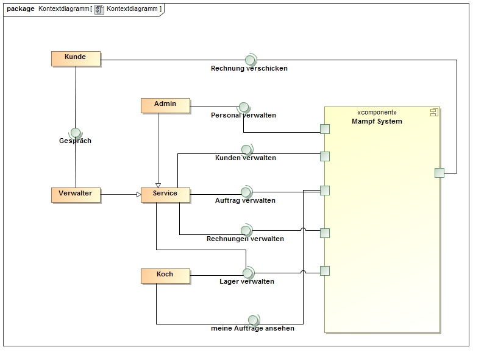
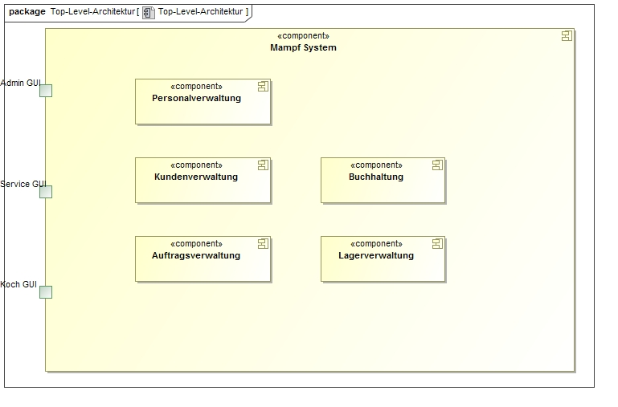
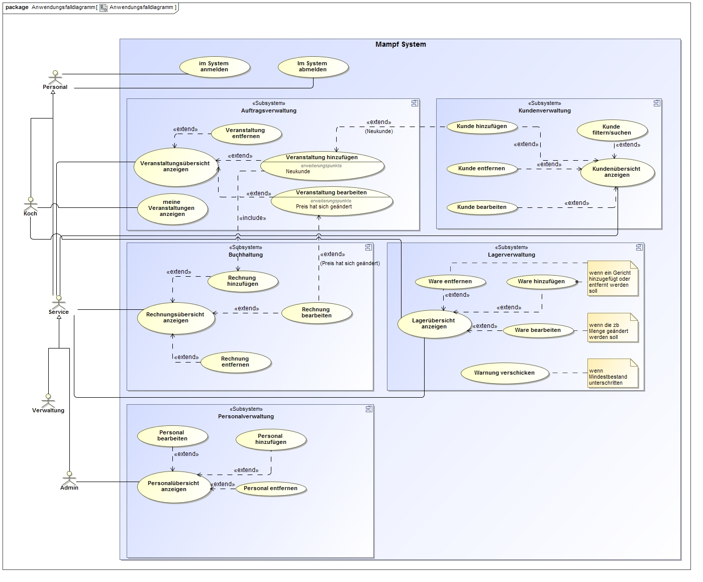

= Entwicklerdokumentation

== Einführung und Ziele
=== Aufgabenstellung: 
Es soll eine Software für die Organisation eines Eventcateringservices realisiert werden. Dabei soll die Software so konzeptioniert sein, dass sich ein Interessent des Eventcateringservices auf einer Angebotsseite einen Überblick über die Angebote (Eventcatering, Partyservice, Mobile Breakfast, Rent-a-Cook) schaffen kann. Die eigentliche Bestellung eines Kunden erfolgt dann per Telefon, sodass der zuständige Mitarbeiter alle wichtigen Daten in das Eventcatering-System eintragen kann. Neben den Daten der Veranstaltungen, sollen auch Daten der Kunden, Mitarbeiter und Buchaltung (Rechnungen und Gehaltsabrechnungen) verwaltet werden können. Der Kunde der Software (Admin) hat alle Befugnisse für das System.
=== Qualitätsziele:
Die Software soll störungsfrei funktionieren, sowie alle vom Kunden geforderten Muss-Kriterien erhalten und erfüllen.

==== Muss-Kriterien:
===== Kundenverwaltung
* Kunden hinzufügen ,löschen, bearbeiten, filtern, sortieren
* Kunden sollen eine ID besitzen

===== Personalverwaltung
* Personal hinzufügen, löschen, bearbeiten, filtern, sortieren +
* Rollen für das Personal (Boss,Verwaltung, Service, Koch)
* Personal Useraccount aktivieren/deaktivieren

===== Auftragsverwaltung
* Veranstaltung hinzufügen, löschen, bearbeiten, filtern, sortieren
* Personal soll einer Veranstaltung zugewiesen werden können
* Personal darf nicht zu 2 Veranstalltungen in der selben Zeit hinzugefügt werden
* Kunde soll einer Veranstaltung zugewiesen werden können
* übersicht/Kalender der Veranstaltungen

===== Buchhaltung
* Rechnung hinzufügen ,löschen, bearbeiten, filtern, sortieren
* Bilanz für einen Zeitraum anzeigen lassen

===== Lagerverwaltung
* Ware hinzufügen ,löschen, bearbeiten, filtern, sortieren

==== Kann-Kriterien
* Köche und Personal sollen für eine Veranstaltung vorgeschlagen werden
* Warnung vom Lager, wenn eine Ware einen Mindestbestand unterschreitet
* grapische Übersicht und Diagramme zu Rechnungen

== Randbedingungen
=== Software-Vorgaben: 
* Java 8
* Google Chrome vers.55

== Kontextabgrenzung
=== Kontextdiagramm

=== Top-level architecture

=== Überblick Anwendungsfalldiagramm

=== Externe Schnittstellen
.Aktionsmöglichkeiten der externen Schnittstellen
[options="header"]
|=========================================
| | Boss | Verwaltung | Koch | Service
| Personal verwalten | x | | | 
| Buchhaltung verwalten | x | x | | 
| Veranstaltungen verwalten | x | x | |
| Kunden verwalten | x | x | |
| Lager verwalten | x | x | x |
| zu bearbeitende Veranstaltungen ansehen | x | x | x | x
|=========================================

== Lösungsstrategie
* Das eigentliche "Herzstück" der Software besteht aus den Packages für die Personenverwaltung (Mitarbeiter und Kunden), Lagerverwaltung, Veranstaltungsverwaltung und Buchhaltung, welche alle über ihre eigenen Conttroller gesteuert werden. Die generelle Persistenz (Javax Persistence) und die Validierung der Formulare zur Eingabe aller Daten in das System werden von Hibernate gemanagt.
Mehrere verwendete Interfaces und Klassen sind im Salespoint-Framework bereits vordefiniert, sodass sie einfach übernommen werden können.

== Bausteinsicht
=== Entwurfsklassendiagramm
image::Bilder/Entwurfsklassendiagramm.jpg[]

* Das System wurde so entwurfen, dass jede Verwaltungseinheit (Lager, Person -> Mitarbeiter und Kunde, Buchhaltung, Veranstaltung, Controller; um die Verwaltungseinheiten zu steuern) ein eigenes Package darstellt. Adressen werden hierbei von 'Person' und 'Veranstaltung' benötigt, sodass die Entscheidung fiel, hierfür ein eigenes Package zu erstellen. Desweiteren repräsentieren die Formulare (Package 'Validation') zur Eingabe sämtlicher Informationen ein zentrales Element des Systems, welche wiederum vom importierten 'org.hibernate.validator' Package auf Richtigkeit überprüft werden. Die Controller benutzen für die generelle Persistenz des Systems das ebenfalls importierte Package 'javax.persistence' und zusätzlich vordefinierte Elemente aus dem Spring-Framework. Mehrere wichtige und verwendete Klassen (Salespoint.UserAccount, SalespointRepository, Salespoint.inventory, sowie die für das Rollenmodel zuständige Enumeration 'Role') waren bereits im Salespoint-Framework vorimplementiert.

== Entwurfsentscheidungen

=== Verwendete Muster
* Model-View-Controller-Muster
* Alle Verwaltungseinheiten stellen jeweils ein Model dar, welches durch den jeweiligen Controller gesteuert wird.

=== Authentifizierung
* SalespointSecurityConfiguration wird für die Anmeldung und Authentifizierung genutzt

=== Persistenz
* Für die Speicherung der Daten auch über längere Zeit wird der Open-Source-Persistenzprovider Hibernate genutzt.
* Im Quellcode wurden die entsprechenden Annotationen gesetzt

=== Kalender
* Opensource "FullCalendar" wurde für die implementierung des Kalenders verwendet. 

=== Benutzeroberfläche:
* Selbst entworfene GUI gemäß Kundenwunsch.
