= Pflichtenheft

:imagesdir: /artefacts

== Mampf Cateringservice

__Version:__    *1.0*

__Status:__     *in Arbeit*

__Stand:__      *05.11.2016*

== Zusammenfassung
Das Pflichtenheft beschreibt die Auflagen und Funktionen der zu erstellenden Anwendung für das Unternehmen Mampf. Hier werden die Erfüllungskriterien zwischen Kunde und der Bearbeitungsfirma festgelegt.
Das Produkt wird im Pflichtenheft mithilfe von Diagrammen genau beschrieben. Der Aufbau wird in der Top-Level-Architektur sowie in Use-Case- und UML-Klassendiagrammen veranschaulicht.
Außerdem werden Muss- sowie Wunschkriterien für das Produkt festgelegt. Der GUI-Aufbau wird zudem mittels Skizzen und Mockups dargestellt und dokumentiert.
Die beschriebene Applikation soll letztendlich auf Verwaltungsebene unterstützend wirken.

== Inhaltsverzeichnis

== Aufgabenstellung und Zielsetzung
Die Software soll die Kundenverwaltung unterstützen, die Personalverwaltung und -zuteilung übernehmen,
die Termine planen, das Zubehör (Dekoration, Ausrüstung) verwalten, den Lebensmittelbedarf bestimmen (Anzahl Gerichte/Platten/belegte Brötchen, Menge an Getränken in Liter),
die Rechnungsstellung an die Kunden vereinfachen und sämtliche Abrechnungen erleichtern. Die Lebensmittelbeschaffung muss nicht betrachtet werden.

== Fachlicher Überblick
Die Software soll als Java-Web-Application mit Hilfe der Frameworks Sales-Point und Spring implementiert werden.

== Systemgrenze und Top-Level-Architektur

=== Kontextdiagramm

image::Bilder/Kontextdiagramm_1.1.jpg[]

=== Top-level architecture
image::Bilder/Top-Level-Architektur_1.0.jpg[]

== Anwendungsfälle

=== Überblick Anwendungsfalldiagramm
image::Bilder/Anwendungsfalldiagramm_1.1.jpg[]

=== Akteure

// See http://asciidoctor.org/docs/user-manual/#tables
[options="header"]
|===

| Name | Beschreibung
| Admin | Zugriff auf ganzes System
| Service | zuständig für die Verwaltung, bis auf die Personalverwaltung
| Koch | ist auf Veranstaltungen tätig, kann das Lager verwalten

|===

=== Anwendungsfallbeschreibungen
image::Bilder/Sequenzdiagramm_Kundenverwaltung_1.0.jpg[]
image::Bilder/Sequenzdiagramm_Veranstaltung_1.0.jpg[]
image::Bilder/Sequenzdiagramm_Admin_1.0.jpg[]
image::Bilder/Sequenzdiagramm_Personal_1.0.jpg[]
image::Bilder/Sequenzdiagramm_Lagerverwaltung_1.0.jpg[]

== Anforderungen

=== Muss-Kriterien

==== Kundenverwaltung
* Kunden hinzufügen ,löschen, bearbeiten, filtern, sortieren
* Kunden sollen eine ID besitzen

==== Personalverwaltung
* Personal hinzufügen, löschen, bearbeiten, filtern, sortieren +
* Rollen für das Personal (Admin, Service,Koch)
* Personal Useraccount aktivieren/deaktivieren

==== Auftragsverwaltung
* Veranstaltung hinzufügen, löschen, bearbeiten, filtern, sortieren
* Personal soll einer Veranstaltung zugewiesen werden können
* Kunde soll einer Veranstaltung zugewiesen werden können
* übersicht/Kalender der Veranstaltungen

==== Buchhaltung
* Rechnung hinzufügen ,löschen, bearbeiten, filtern, sortieren
* Bilanz für einen Zeitraum anzeigen lassen

==== Lagerverwaltung
* Ware hinzufügen ,löschen, bearbeiten, filtern, sortieren

=== Kann-Kriterien
* Köche und Personal sollen für eine Veranstaltung vorgeschlagen werden
* Warnung vom Lager, wenn eine Ware einen Mindestbestand unterschreitet
* grapische Übersicht und Diagramme zu Rechnungen

== GUI Prototyp

=== Überblick: Dialoglandkarte
image::GUI-Entwurf/GUI-Entwurf.jpg[]

=== Dialogbeschreibung
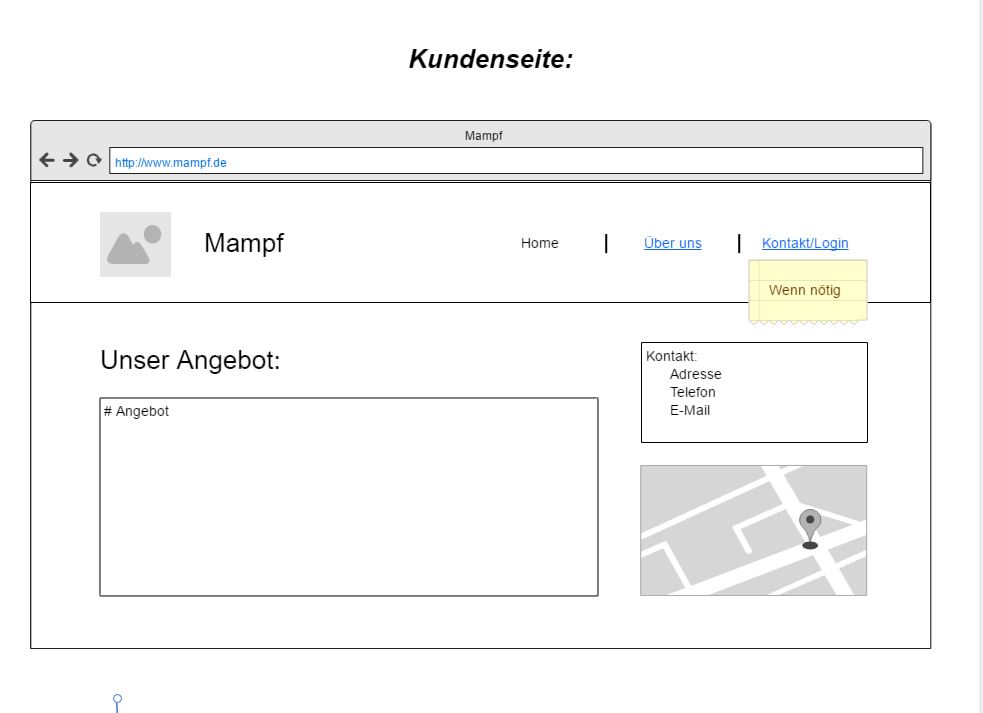
* Kundenseite: Dient dem Kunden zur Übersicht der Angebote, dem Kontakt und anderem.

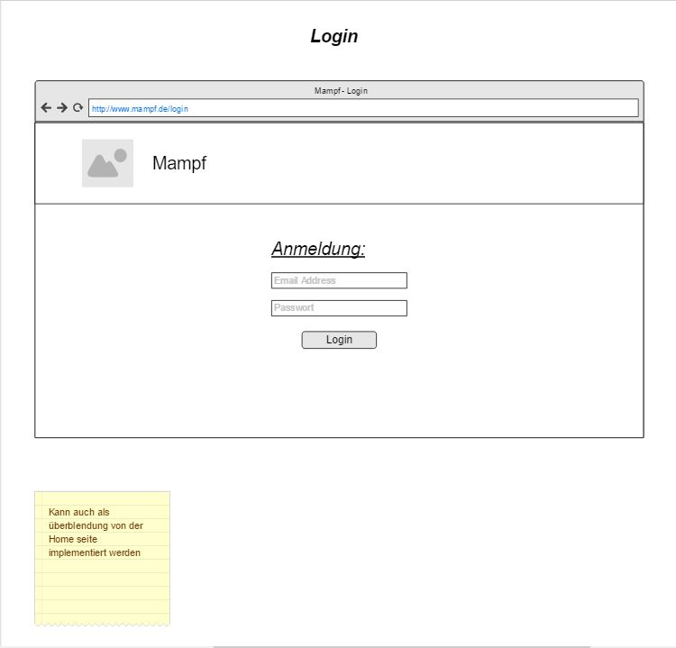
* Login: Ausschließlich für die Mitarbeiter.

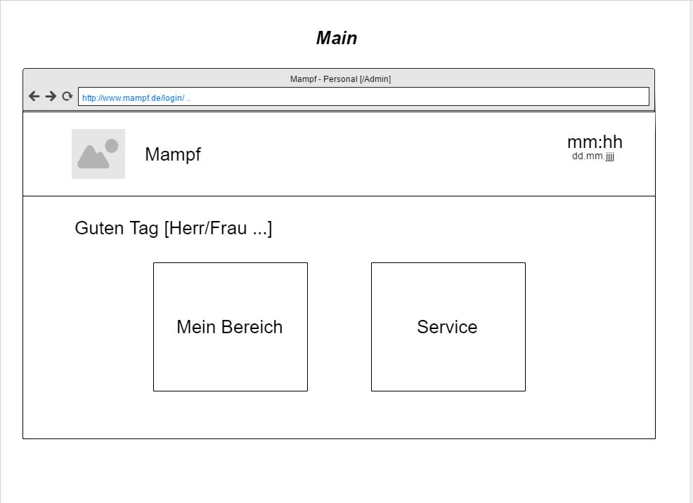
* Main-Seite: Leere HTML Seite wo das Script läuft.
  Begrüßung mit Anrede, sowohl momentane Uhrzeit mit Datum (und folgende Fenster).
  Weiterleitung zu dem Servicebereich und dem Persönlichen Bereich (je nach Login Admin oder Personal)

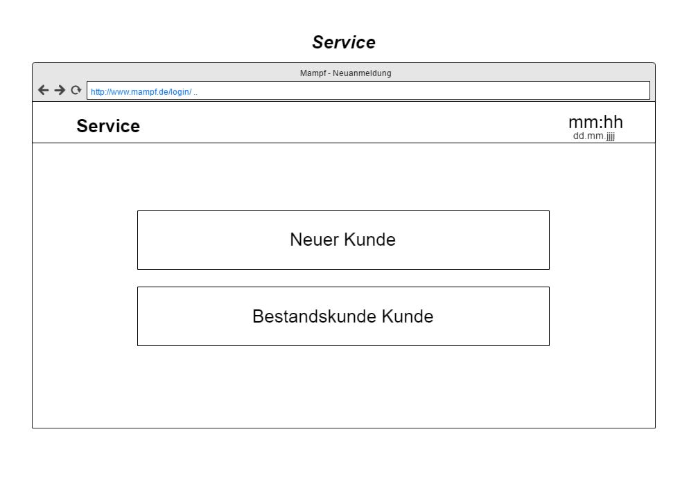
* Auswahl je nachdem, ob der Kunde der gerade Anruft schonmal etwas bestellt hat.

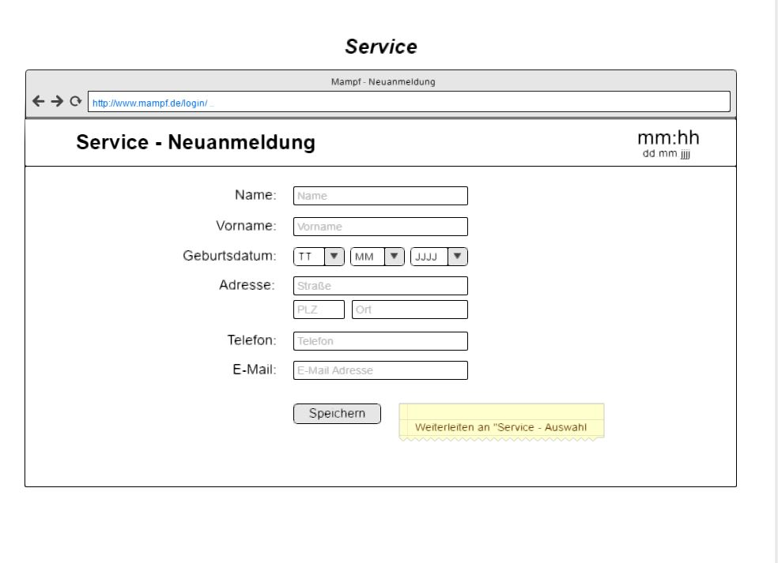
* Anmeldung: Falls der Kunde Neukunde ist. Weiterleitung zu "Bestellung".

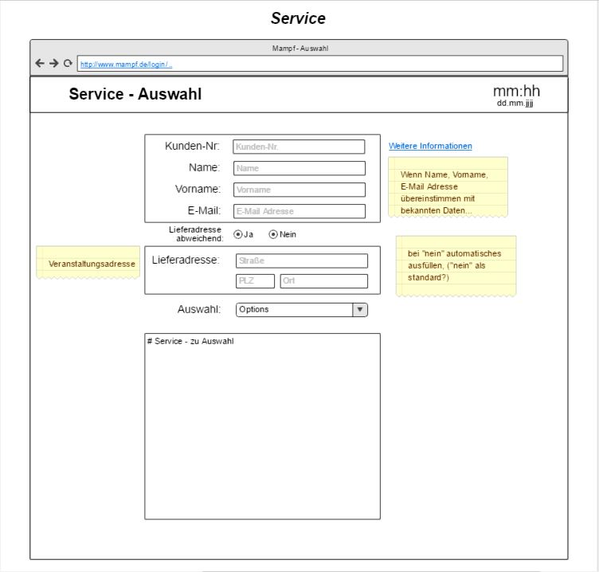
* Bestellung: Wenn Name und Vorname, E-Mail, oder Kundennummer vom System erkannt, werden die restlichen Felder Vervollständigt, ebenso wenn die Lieferadresse nicht abweicht.
  Falls man Weitergeleitet wurde, werden die Felder automatisch ausgefüllt.
* Je Auswahl wird die Seite unten mit "Eventcatering", Partyservice, "Mobile Breakfest" oder "Rent-a-Cook" erweitert.

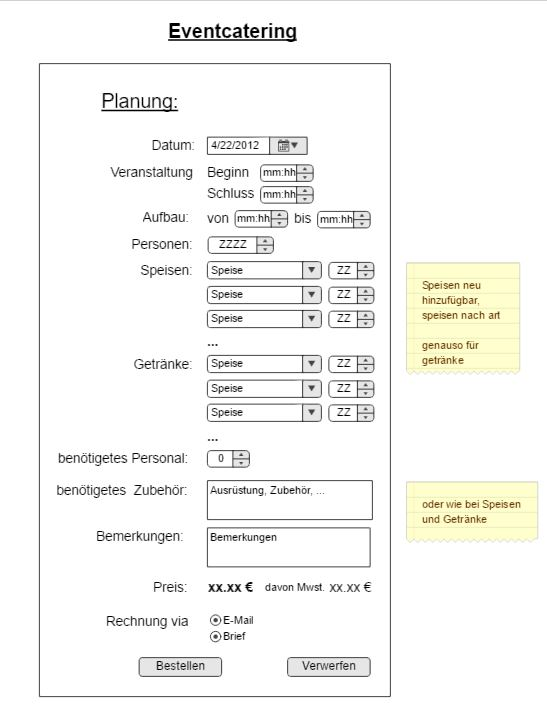
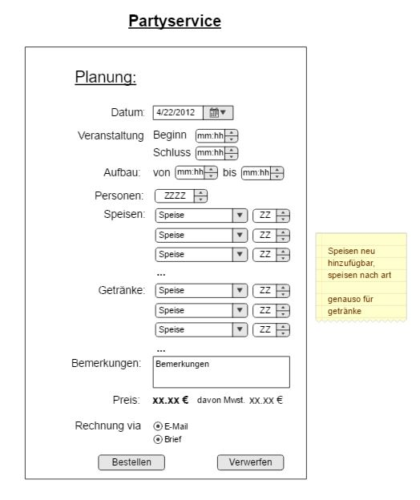
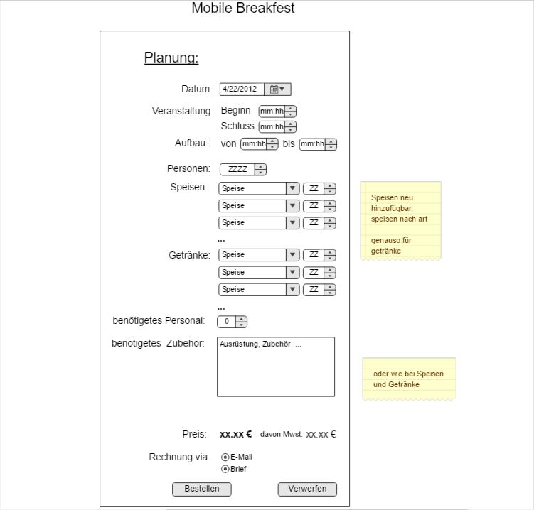
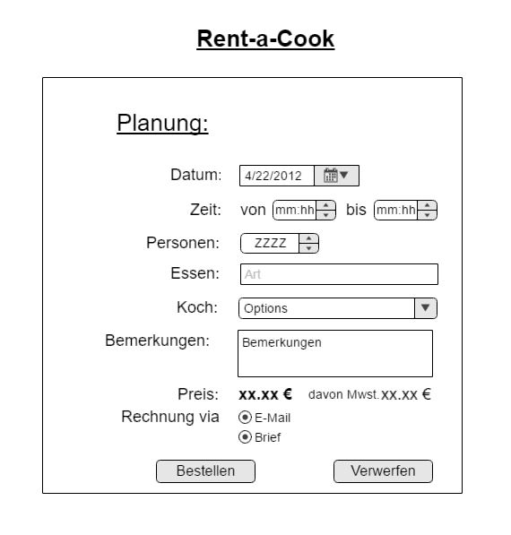
* Für die Eintragung aller wichtigen_Sachen für die Bestellung.

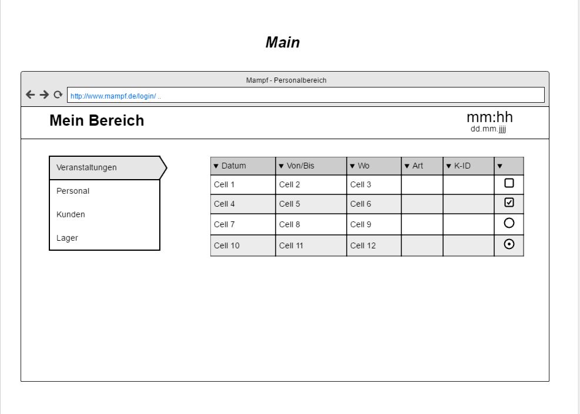
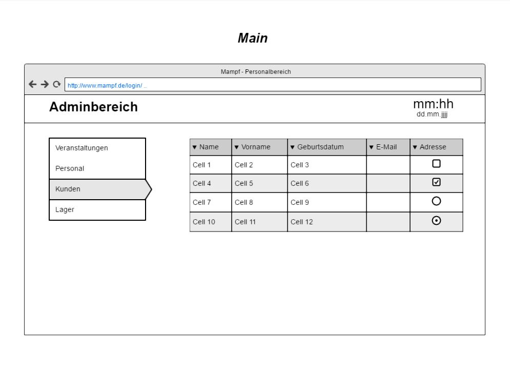
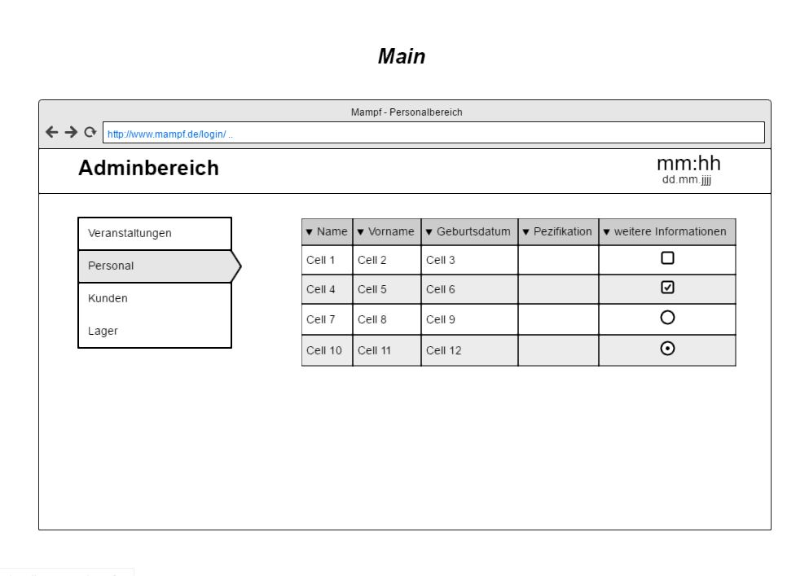
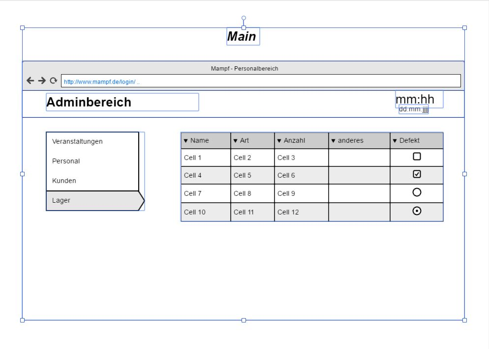
* Admin: Mein Bereich: Dient dem Verwalten von den Veranstaltungen, den Kunden, dem Personal und dem Lager. "Veranstaltungen" als 1. Seite nach weiterleitung.

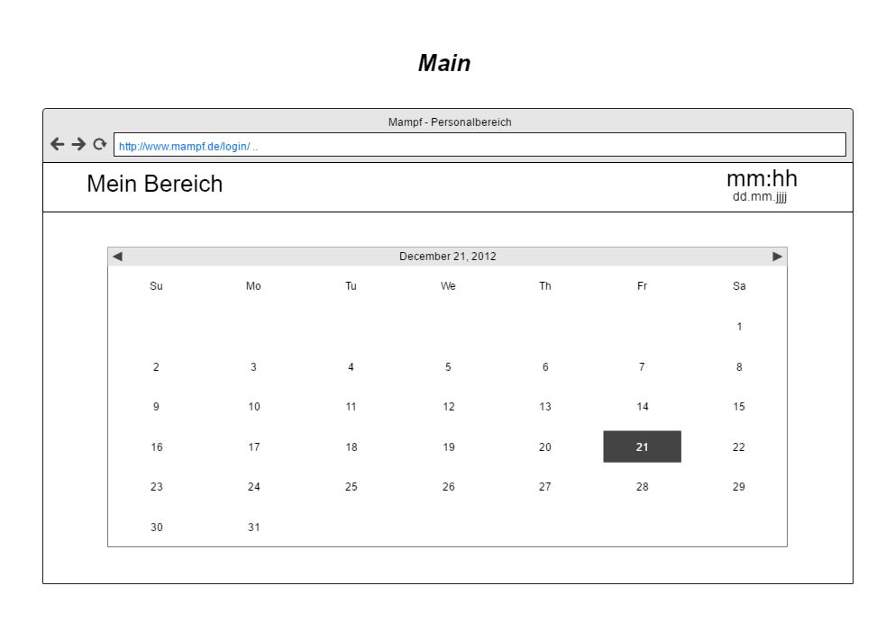
* Personal: Mein Bereich: Übersicht mit einem Kalender mit den jeweilige Terminen und Uhrzeiten je Tag für das Personal.

== Datenmodell

=== Überblick: Klassendiagramm
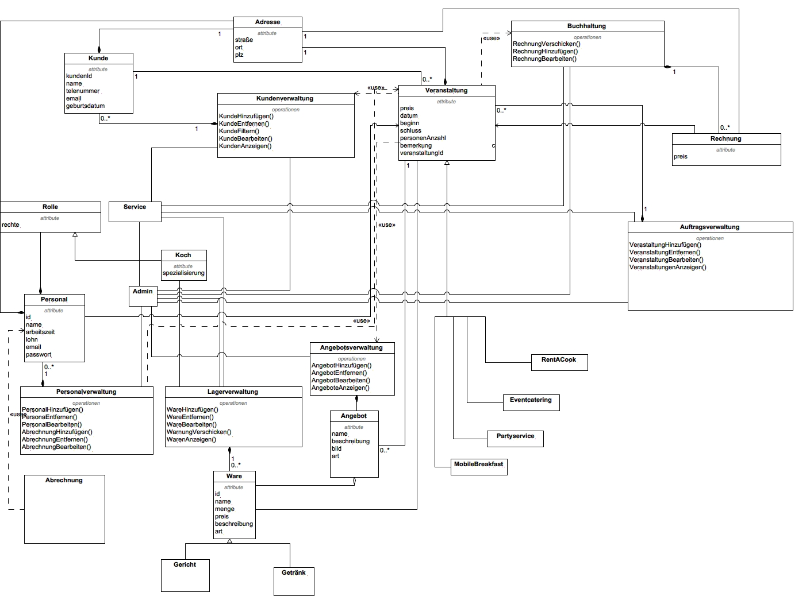

=== Klassen und Enumerationen

// See http://asciidoctor.org/docs/user-manual/#tables
[options="header"]
|===
|Klasse/Enumeration |Beschreibung
|Auftragsverwaltung |Dient der Verwaltung der Veranstaltungen. Ermöglicht auch das Anzeigen aller Veranstaltungen, sowie deren Informationen.
|Veranstaltung		|Beschreibt eine Veranstaltung .
|Kundenverwaltung	|Dient der Verwaltung der Kunden. Ermöglicht das Anzeigen alles Kunden, sowie deren Informationen.
|Kunde				|Beschreibt einen Kunden.
|Personalverwaltung |Dient der Verwaltung des Personals. Ermöglicht das Anzeigen des gesammten Personal, sowie deren Informationen.
|Personal			|Beschreibt das Personal.
|Buchhaltung		|Dient der Verwaltung der Rechnungen. Ermöglicht das Anzeigen aller Rechnungen, sowie deren Information.
|Rechnung			|Beschreibt eine Rechnung.
|Lagerverwaltung	|Dient der Verwaltung des Lagers. Ermöglicht das Anzeigen aller Waren.
|Ware				|Beschreibt die Ware.
|Angebotsverwaltung	|Dient der Verwaltung der Angebote.
|Angebot			|Beschreibt ein Angebot.
|Adresse			|Beschreibt eine Adresse.
|Rolle				|Regelt die Rechte für den Zugriff auf bestimmte Funktionen im System.
|===

== Aktzeptanztestfälle

[options="header"]
|===
|#ID |Beschreibung
|A1  |Der Benutzer kann sich alle Veranstaltungen anzeigen lassen und eine Veranstaltung auswählen, um die Informationen zu der Veranstaltung zu sehen.
|A2	 |Der Benutzer ist in der Lage neue Veranstaltungen in die Übersicht hinzuzufügen.
|A3  |Veranstaltungen lassen sich durch die Eingabe eines Kunden filtern.
|A4	 |Zu einer Veranstaltung lassen sich Köche und anderes personal zuweisen.
|A5	 |Das Personal kann sich seine Veranstaltungen anzeigen lassen, zu denen es zugewiesen ist.
|A6  |Mitarbeiter sollen Kunden anhand ihrer vom System zugeordneten IDs suchen und anzeigen lassen können.
|A7  |Der Administrator ist in der Lage Kunden zu löschen.
|A8  |Die Weboberfläche ist unter einer bestimmten Adresse erreichbar.
|A9  |Im Lager sieht man alle Waren und deren Menge.
|A10 |Eine Ware lässt sich hinzufügen und entfernen.
|A11 |Die Menge einer Ware im Lager lässt sich ändern.
|A12 |Rechnung soll per Email an den Kunden verschickt werden können.
|A13 |Der Benutzer kann sich alle Rechnungen anzeigen lassen und eine Rechnung auswählen, um die Details der Rechnung zu sehen.
|A14 |Der Benutzer kann sich das gesammte Personal anzeigen lassen und eine Person auswählen, um die Informationen zu der Person zu sehen.
|A15 |Personal kann hinzugefügt und entfernt werden.
|===

== Offene Punkte
Offene Punkte werden entweder direkt in der Spezifikation notiert. Wenn das Pflichtenheft zum finalen Review vorgelegt wird, sollte es keine offenen Punkte mehr geben.
